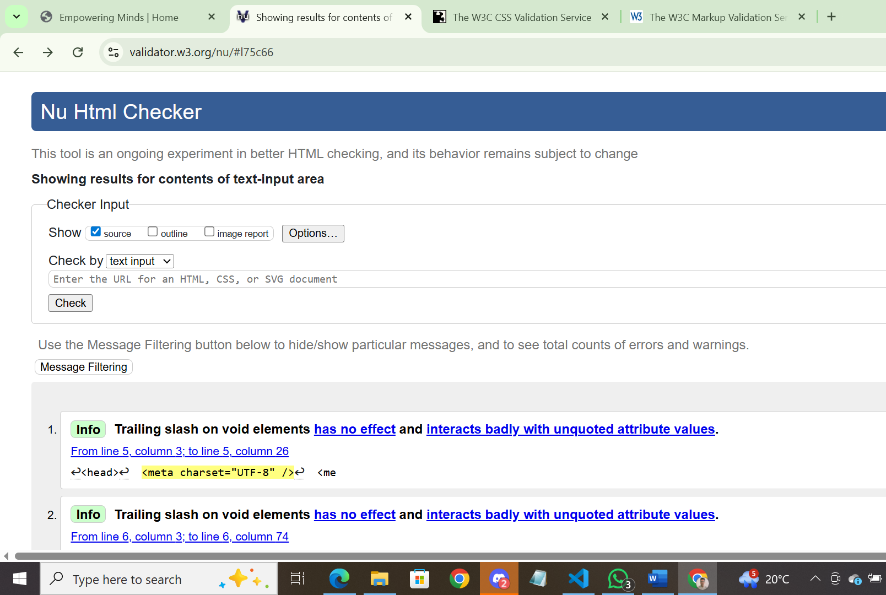
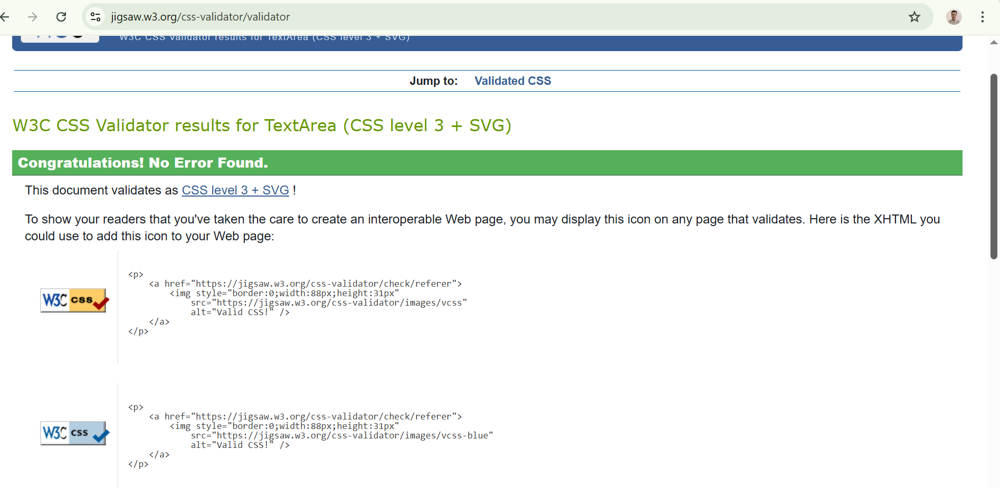

#  Website Testing – Empowering Minds

This document outlines the testing checklist for the **Empowering Minds** mental health awareness website.

---

## 1. code Testing using W3C

## 2. Functional Testing

| Test Case                        | Expected Result                                        | Pass/Fail  | Notes                         |
|----------------------------------|--------------------------------------------------------|----------- |-------------------------------|
| Homepage loads                   | `index.html` loads without errors                      | ✅         |                               |
| Navigation links                 | Links navigate to correct sections/pages               | ✅         |                               |
| Contact page                     | `contact.html` displays content correctly              | ✅         |                               |
| Submission page loads            | `success.html` displays content properly               | ✅         |                               |
| Images load correctly            | All images are visible and not broken                  | ✅         |                               |
| Buttons work                     | All interactive elements behave as expected            | ✅         |                               |

---

## 3. Visual/UI Testing

| Test Area                        | Expected Result                                        | Pass/Fail | Notes                         |
|----------------------------------|--------------------------------------------------------|-----------|-------------------------------|
| Responsive layout                | Website adapts to mobile, tablet, and desktop screens  | ✅         |                               |
| Text readability                  | Fonts are legible and contrast is appropriate         | ✅        |                               |
| Quotes section displays properly  | Quotes are styled clearly and consistently            | ✅        |                               |
| Visual consistency                | Colors, spacing, fonts are uniform across pages       | ✅        |                               |

---

## 4. Browser Compatibility

| Browser                | Result   | Notes         |
|----------------         |---------|---------------|
| Google Chrome          | ✅       |               |
| Safari                 | ✅       |               |
| Mobile (Chrome/Safari) | ✅       |               |

---

## 5. Accessibility Testing

| Check                       | Expected Result                                  | Pass/Fail | Notes |
|-----------------------------|--------------------------------------------------|-----------|-------|
| Alt text for images         | All images include meaningful alt attributes     | ✅        |       |
| Keyboard navigation         | Entire site is navigable via keyboard (Tab key)  | ✅        |       |
| Semantic HTML               | Proper use of headings (`h1`, `h2`, etc.)        | ✅        |       |

---
## 6. Perfrmance Testing
|To be done|

